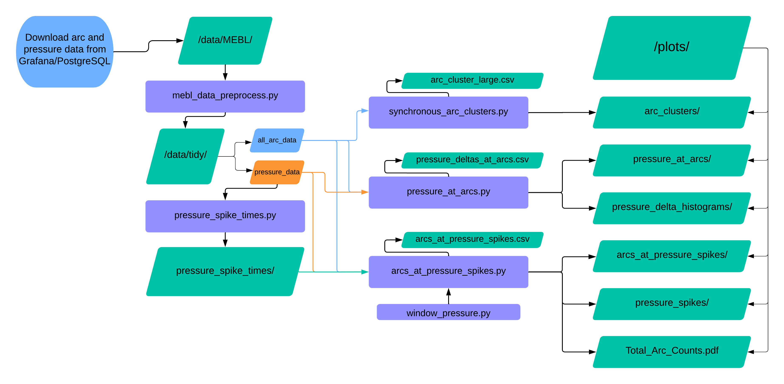

## REPOSITORY FOR MULTIBEAM ARC AND PRESSURE DATA ANALYSIS

### <ins>Flowchart and Manual</ins>


1. Database is accessed via Grafana; `all arc counts` and `pressure` data is downloaded to the repository’s `data/MEBL/` subfolder.

2. The two downloaded dataframes are passed into the file `mebl_data_preprocess.py`, which cleans the data and passes the tidy files to the `data/tidy/` subfolder. This becomes the new data source for the rest of the programs to run. 
    - Terminal command to run `mebl_data_preprocess.py` (current directory is repository’s root, all programs and scripts are in the folder `python_files/`):
    ```
    python3 python_files/mebl_data_preprocess.py --arc_filename data/MEBL/MEBL3_All\ Arc\ Counts-data-as-joinbyfield-2024-07-01\ 10_16_54.csv --pressure_filename data/MEBL/MEBL3_Pressure-data-2024-06-28\ 09_40_08.csv
    ``` 
    - Note: 
        - `–arc_filename`, `–pressure_filename` arguments are required, and should be the relative paths to the downloaded MB csv files 
        - If filenames include whitespace, put an escape character (\) before the whitespace
3. The tidy `pressure_data` file is used as input to the `pressure_spike_times.py` file, which identifies and stores the timestamps of all system vacuum pressure spikes.
    - Pressure spikes are defined as observations in the pressure dataset for which the pressure value exceeds 2x the “local pressure mean”. This mean is calculated from the pressure values of the 10 preceding seconds to the spike time
    - Terminal Terminal command to run: 
    ```
    python3 python_files/pressure_spike_times.py --pressure_filename data/tidy/pressure_data --time_range 5
    ```
    - Note: 
        - `–pressure_filename` argument is required; it is the path to the clean pressure_data file 
        - `–time_range` argument is optional; it is the number of seconds for which a local mean pressure value is calculated, a factor in the identification of the spike threshold (default=5)
        - Pressure spike timestamps are separated by pressure type and time_range (this information is held in the filenames) and saved as JSON files to the `pressure_spike_times/` folder
4. Once pressure_spikes have been saved, any of the 3 features may be utilized:
    1. `synchronous_arc_clusters.py`
    2. `pressure_at_arcs.py`
    3. `arcs_at_pressure_spikes.py` and `window_pressure.py`
#### <ins>synchronous_arc_clusters.py</ins>
**Inputs:**
- Only the clean `all_arc_data` file is passed as an input

**Outputs:**
- `plots/arc_clusters`: A folder containing heatmaps displaying synchronous arc counts and percentages. 
  - Arcs are considered synchronous if an arc event occurs at the same time for two different system components. 
  - Heatmaps of these synchronous arcs are made for each component, as well as one heatmap displaying the entire synchronous arc dataframe (63 components x 63 components heatmap).

**Terminal Terminal command to run:**

<ins>Note</ins>:

#### pressure_at_arcs.py:
**Inputs:**
- Scripts take both clean data files from `data/tidy/`.

**Outputs:**
- `plots/pressure_at_arcs/`: A folder containing time-series line graphs of the system’s chamber and column pressure values over 30 second windows surrounding each arc event. 
  - The folder is made up of one subfolder for every system power supply component, and each of those folders contains one plot for every arc event that happened within that component. 
  - Plots also display pressure maximums (within +/- 5 seconds to the arc events), and pressure means for the 10 seconds preceding the maximum.
- `plots/pressure_delta_histograms/`: A folder containing histograms displaying the distribution of “pressure delta” values across all arc events. 
  - Pressure deltas are calculated as the difference between the pressure maximum and pressure mean (as described in 6.b.i). 
  - Histograms are created for both chamber and column pressure types, and the corresponding data is saved to `data/pressure_deltas_at_arcs.csv`.

**Terminal Terminal command to run:**

<ins>Note</ins>:

#### arcs_at_pressure_spikes.py and window_pressure.py:
**Inputs:**
- Both clean dataframes from `data/tidy/` and both json files in `pressure_spike_times/` are used as input.

**Outputs:**
- `plots/Total_Arc_Counts.pdf`: A barchart showing how many total arcs there are for each system power supply component.
- `plots/pressure_spikes/`: A folder that contains time-series line-graph plots displaying the vacuum pressure values over a 20s range surrounding every spike event.
- `plots/arcs_at_pressure_spikes/`: A folder containing barcharts of the counts and percentages of arcs that occurred at the same time as a pressure spike for every system power supply component. 
  - The corresponding dataframe is saved to `data/arcs_at_pressure_spikes.csv`.

**Terminal Terminal command to run:**

```python3 python_files/arcs_at_pressure_spikes.py --arc_filename data/tidy/all_arc_count_data --pressure_filename data/tidy/pressure_data --chamber_json pressure_spike_times/chamber_spike_times_5_sec.json --column_json pressure_spike_times/column_spike_times_5_sec.json```

<ins>Note</ins>: 
- `–arc_filename`, `–pressure_filename`, `–chamber_json`, `–column_json` are all required, must be relative paths to each respective data file.

The `window_pressure.py` file is inherited by the `arcs_at_pressure_spikes.py` file, so no commands need to be run for that script specifically.

### File Descriptions
- ```mebl3_data_preprocess.ipynb``` makes the original dataframes tidy (original and cleaned dataframes are in ```data/MEBL3```, which only exists locally)
- ```pressure_spike_times``` identifies timestamps of spikes in the Column Pressure and Chamber Pressure measurements of MEBL3
    * Timestamp values are saved as JSON dictionaries in ```data/pressure_spike_times```
- ```arc_at_pressure_spikes.ipynb``` takes the timestamps of ```data/pressure_spike_times``` and identifies arc events that are synchronous with these pressure spikes
    * Arc counts, counts of arc synchronous with pressure spikes, and percents of arc synchronous with pressure spikes are calculated for each Column - High Voltage Power Supply component; saved as dataframe in ```data/arcs_with_pressure_spikes```
    * This file also generates plots for the total arc counts (```plots/Total_Arc_Counts.pdf```) and for counts & percentages of synchronous arc-pressure spike events (```plots/arcs_with_pressure_spikes```)
- ```synchronous_arc_clusters.ipynb``` identifies synchronous arc events between Column - High Voltage Power Supply components
    * Heatmaps of these synchronous arc events (both as counts and percentages of total component arc events) are stored in ```plots/arc_clusters```
- ```pressure_at_arcs``` files (3 of them) were created for the purpose of generating lineplots of pressure data (both chamber and column vacuums) for a 20 second window surrounding an arc event. Plots are produced and stored in ```plots/pressure_at_arcs/``` with every subfolder holding plots for each arc by column power supply component. 3 were made during the iterative project development cycle, as I was constantly trying to improve the effectiveness of plots and speed of the data filtration process, but the 3rd one is the best one to use.
- All files beginning with ```window_``` were created in the beginning phase of this project and were originally meant to be a tool for visualizing small chunks of data
    * Ultimately, the only one of these files that was useful to the whole project is ```window_pressure.ipynb```, as it is used to generate the plots of pressure values around spike events in ```plots/pressure_spikes```
- ```Z_arc_events_timestamp.ipynb``` is NOT USED, instead it acted as brainstorming for the tasks accomplished by ```arc_at_pressure_spikes.ipynb```